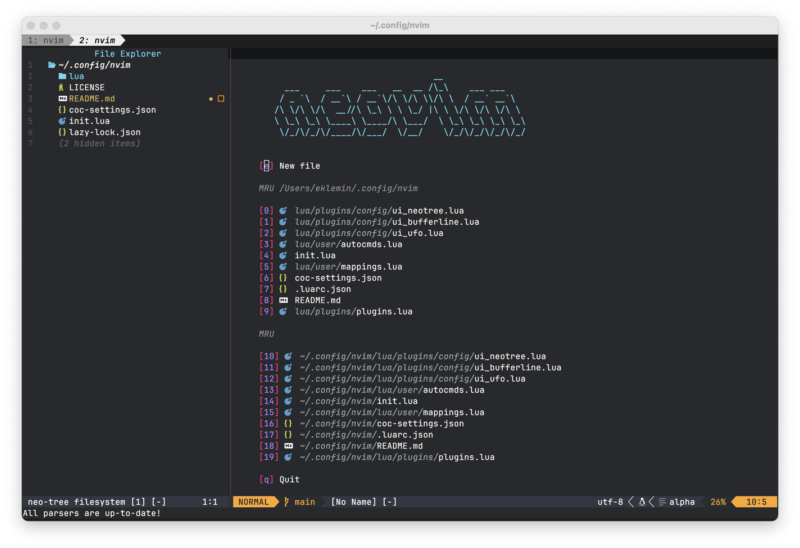
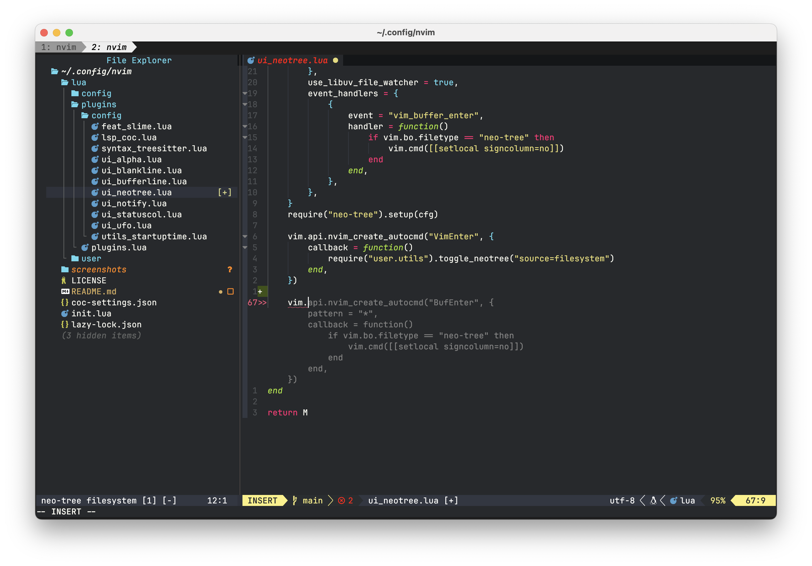
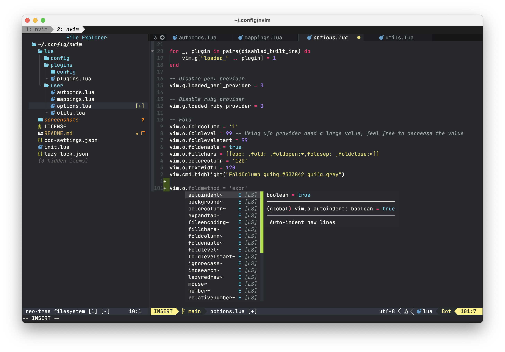
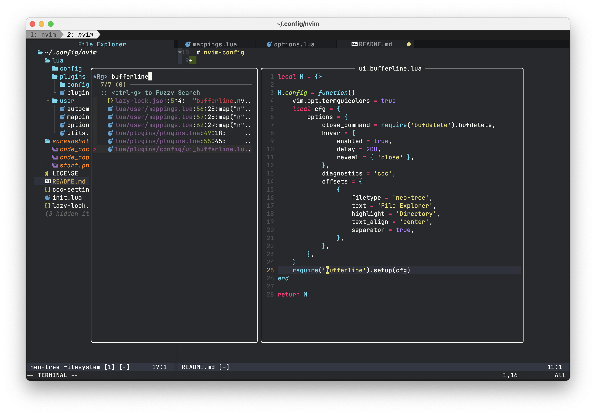

# nvim-config

> Nvim v0.9.x config for MacOS and kitty terminal with CoC lsp.

## Table of contents

* [Screenshots 📷](#screenshots-)
* [Installation 🛠](#installation-)
* [Language support](#language-support)

## Screenshots 📷







## Installation 🛠

```bash
git clone https://github.com/evgeniy-klemin/nvim-config.git ~/.config/nvim
nvim
```

## Language support

* golang
* python
* lua
