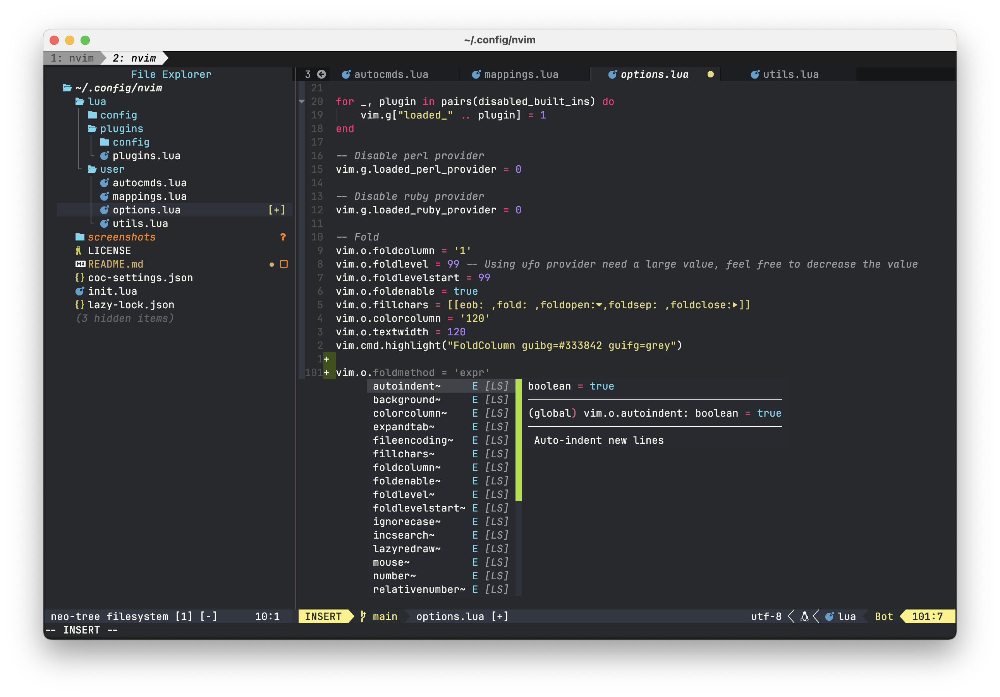

# nvim-config

Lua-based Neovim config for macOS + kitty terminal.

Leader key: `.`

## Screenshots 📷





## Installation 🛠

Part of [dotfiles](https://github.com/evgeniy-klemin/dotfiles), installed via GNU Stow:

```bash
cd ~/dotfiles
stow nvim
nvim  # plugins install automatically via lazy.nvim
```

## Structure

```
init.lua                 -- entry point (leader, python3 path, requires)
lua/
  config/lazy.lua        -- lazy.nvim bootstrap
  user/
    options.lua          -- general options (indent, search, fold, etc.)
    mappings.lua         -- key mappings
    autocmds.lua         -- autocommands
    utils.lua            -- helper functions
  plugins/
    plugins.lua          -- plugin specs
    config/              -- per-plugin configuration
```

## Key mappings

| Key | Mode | Action |
|-----|------|--------|
| `Q` | n | Quit |
| `.ff` | n | Find files (fzf) |
| `.fl` | n | Live grep (fzf) |
| `.fgf` | n | Git files (fzf) |
| `.fgb` | n | Git branches (fzf) |
| `.fr` | n | Resume last search |
| `Shift-F` | n | Toggle Neo-tree |
| `f` | n | Reveal file in Neo-tree |
| `.w` | n | Close buffer |
| `.W` | n | Close other buffers |
| `Shift-H/L` | n | Prev/next buffer |
| `Ctrl-H/J/K/L` | n | Navigate splits |
| `Shift-Alt-H/J/K/L` | n | Resize splits |
| `..h/j/k/l` | n | Swap buffers between splits |
| `..t` | n/t | Toggle floating terminal |
| `Alt-J/K` | n/v | Move line/block up/down |
| `Space Space` | n | Toggle fold |
| `zR` / `zM` | n | Open/close all folds |
| `.fm` | n | Format file |
| `.tt` | n | Toggle Tagbar |
| `.yf` | n/v | Yank file:line (relative) |
| `.yF` | n/v | Yank file:line (absolute) |
| `Tab` | i | Accept Copilot suggestion or normal tab |

## Plugins

**UI:** monokai theme, lualine, bufferline, neo-tree, alpha (start screen), indent-blankline, nvim-ufo (folds), gitsigns, nvim-notify, statuscol, which-key

**LSP:** mason + mason-lspconfig, nvim-lspconfig, none-ls (formatting/linting)

**Autocomplete:** nvim-cmp, copilot.lua, copilot-cmp, tabnine, LuaSnip

**Syntax:** treesitter

**Utils:** fzf-lua, vim-fugitive, Comment.nvim, vim-slime, floaterm, smart-splits, kitty-scrollback

## Language support

- Go
- Python
- Lua
