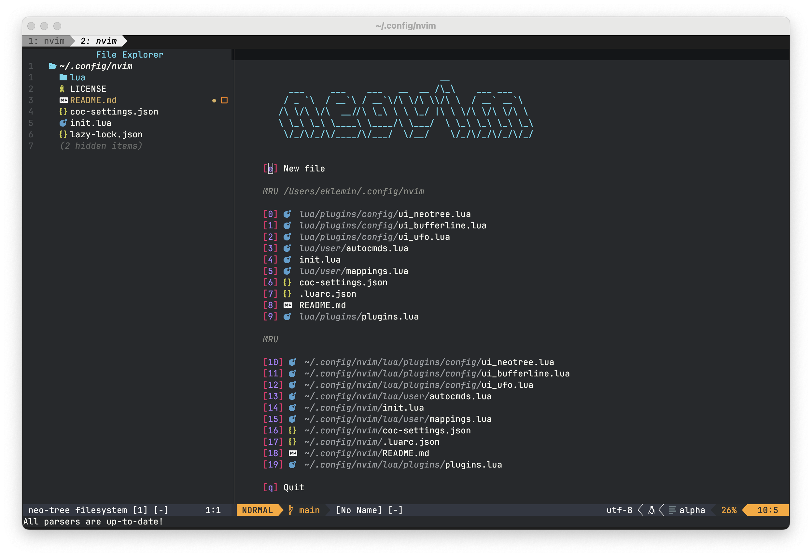
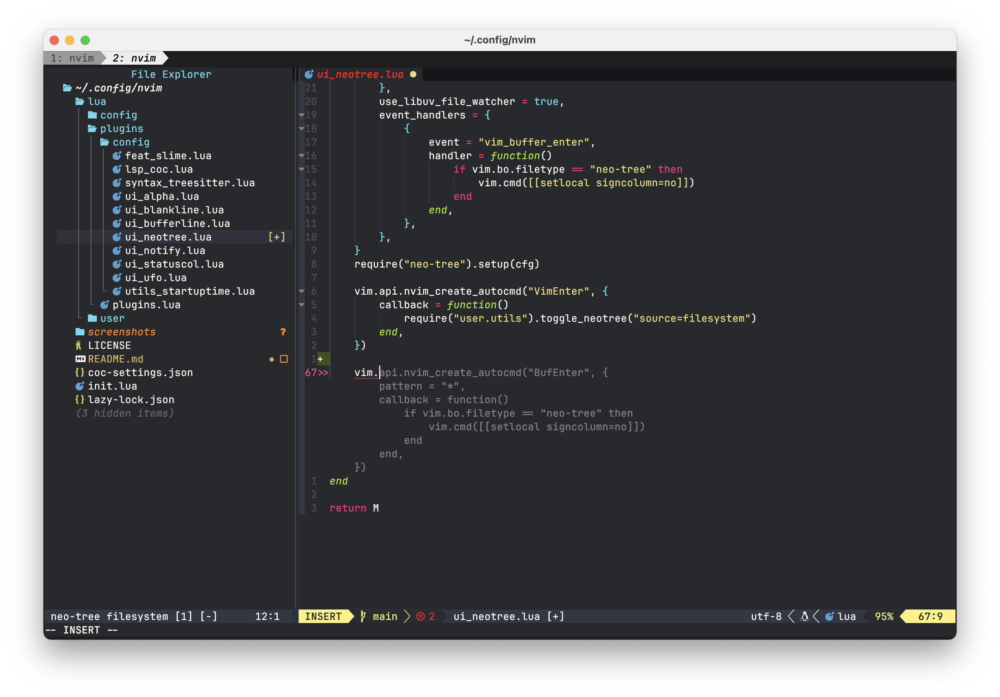
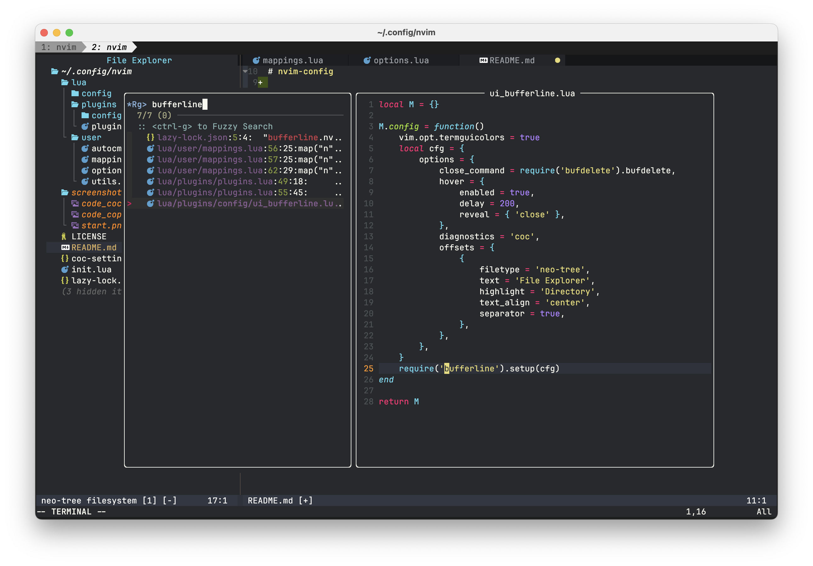

# nvim-config

Lua-based Neovim config for macOS + kitty terminal.

Leader key: `.`

## Screenshots





## Installation

Part of [dotfiles](https://github.com/evgeniy-klemin/dotfiles), installed via GNU Stow:

```bash
cd ~/dotfiles
stow nvim
nvim  # plugins install automatically via lazy.nvim
```

## Structure

```
init.lua                 -- entry point (leader, python3 path, requires)
lua/
  config/lazy.lua        -- lazy.nvim bootstrap
  user/
    options.lua          -- general options (indent, search, fold, etc.)
    mappings.lua         -- key mappings
    autocmds.lua         -- autocommands
    utils.lua            -- helper functions
  plugins/
    plugins.lua          -- plugin specs
    config/              -- per-plugin configuration
```

## AI code assistance — minuet-ai.nvim (local Ollama)

Inline ghost text suggestions powered by a local LLM via Ollama (JetBrains Mellum-4b-sft-all). Shows multi-line suggestions as virtual text directly in the editor.

Prerequisites:
```bash
brew install ollama
brew services start ollama
ollama pull JetBrains/Mellum-4b-sft-all
```

| Key | Mode | Action |
|-----|------|--------|
| `Tab` | i | Accept suggestion (or insert Tab if no suggestion) |
| `Alt-a` | i | Accept first line only |
| `Alt-]` | i | Next suggestion |
| `Alt-[` | i | Previous suggestion |
| `Alt-e` | i | Dismiss suggestion |

## Completion menu (nvim-cmp)

Triggered manually with `Ctrl-Space` (autocomplete is off by default). Sources by priority:

| Source | Label | Description |
|--------|-------|-------------|
| nvim_lsp | `[LSP]` | Language server completions |
| nvim_lua | `[Lua]` | Neovim Lua API completions |
| path | `[Path]` | File path completions |
| buffer | `[Buffer]` | Words from open buffers (fallback when no LSP) |

Command line completion (cmp-cmdline) — auto-triggers as you type:
- `:` — command and path completion (`Ctrl-N`/`Ctrl-P` navigate, `Tab` confirm or trigger)
- `/` and `?` — buffer word completion for search

## Key mappings

| Key | Mode | Action |
|-----|------|--------|
| `Q` | n | Quit |
| `.ff` | n | Find files (FzfLua) |
| `.fl` | n | Live grep (FzfLua, requires ripgrep) |
| `.fgf` | n | Git files (FzfLua) |
| `.fgb` | n | Git branches (FzfLua) |
| `.fr` | n | Resume last search |
| `Shift-F` | n | Toggle Neo-tree |
| `f` | n | Reveal file in Neo-tree |
| `.w` | n | Close buffer |
| `.W` | n | Close other buffers |
| `Shift-H/L` | n | Prev/next buffer |
| `Ctrl-H/J/K/L` | n | Navigate splits |
| `Shift-Alt-H/J/K/L` | n | Resize splits |
| `..h/j/k/l` | n | Swap buffers between splits |
| `..t` | n/t | Toggle floating terminal |
| `Alt-J/K` | n/v | Move line/block up/down |
| `Space Space` | n | Toggle fold |
| `zR` / `zM` | n | Open/close all folds |
| `.fm` | n | Format file |
| `gd` | n | Go to definition (LSP) |
| `K` | n | Hover info (LSP) |
| `.rn` | n | Rename symbol (LSP) |
| `gl` | n | Show diagnostics float |
| `yw` / `pw` | n | Copy/paste word under cursor (register 1) |
| `.yf` | n/v | Yank file:line (relative) |
| `.yF` | n/v | Yank file:line (absolute) |
| `Ctrl-Space` | i | Open completion menu |
| `Ctrl-P/N` | i | Navigate completion items |
| `CR` | i | Confirm completion |

## Plugins

**UI:** monokai theme, lualine, bufferline, neo-tree, alpha (start screen), indent-blankline, nvim-ufo (folds), gitsigns, nvim-notify, statuscol, which-key, virt-column

**LSP:** mason + mason-lspconfig + mason-tool-installer, nvim-lspconfig

**Formatting:** conform.nvim (prettier, stylua, isort, black, gofumpt, goimports-reviser, golines) — format-on-save

**Linting:** nvim-lint (pylint)

**AI suggestions:** minuet-ai.nvim (local Ollama + JetBrains Mellum-4b ghost text)

**Autocomplete:** nvim-cmp, cmp-cmdline, lspkind (icons)

**Syntax:** nvim-treesitter

**Utils:** fzf-lua (requires ripgrep), vim-fugitive, Comment.nvim, vim-slime, floaterm, smart-splits, kitty-scrollback, vim-startuptime

## Language support

| Language | LSP server | Formatters / Linters |
|----------|-----------|---------------------|
| Go | gopls | golines, gofumpt, goimports-reviser |
| Python | pyright | isort, black, pylint |
| Lua | lua_ls | stylua |
| JS/TS/HTML/CSS | — | prettier |
